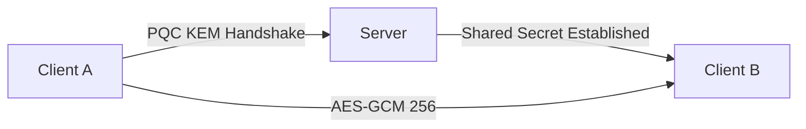

# Quantum-Secure Chat (Go)

A high-performance chat infrastructure designed to be resistant against future quantum computing attacks.

## 🛡️ Security Architecture
This project implements hybrid cryptographic schemes combining traditional ECC with **Post-Quantum Cryptography (PQC)**.



## 🚀 Features
- **PQ Resistance**: Integration of lattice-based cryptography concepts.
- **Perfect Forward Secrecy**: Per-session ephemeral keys.
- **Scalability**: Goroutine-per-client model for high concurrency.

## 🛠️ Usage
```bash
go run cmd/server/main.go
```